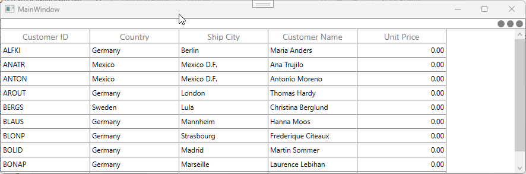

# How to update the SummaryRow when it is not in view in WPF DataGrid (SfDataGrid)?

In [WPF SfDataGrid](https://www.syncfusion.com/wpf-controls/datagrid), when the summary row is not in view, it is not internally processed to update its values due to an architectural limitation.
To overcome this, you can use the [SfDataGrid.View.RecordPropertyChanged](https://help.syncfusion.com/cr/wpf/Syncfusion.Data.ICollectionViewAdv.html#Syncfusion_Data_ICollectionViewAdv_RecordPropertyChanged) event. When a cell value changes, you can determine the row type and pass the summary row index to the **UpdateDataRow** method within the RecordPropertyChanged event handler. This ensures that the summary row values are updated correctly.

**C#**
```csharp
 sfDataGrid.Loaded += SfDataGrid_Loaded;

 private void SfDataGrid_Loaded(object sender, RoutedEventArgs e)
 {
     if (sfDataGrid.View != null) 
         sfDataGrid.View.RecordPropertyChanged += View_RecordPropertyChanged;
 }

 private void View_RecordPropertyChanged(object sender, System.ComponentModel.PropertyChangedEventArgs e)
 {
     if (sfDataGrid.View != null && sfDataGrid.View.SummaryRows.Count > 0)
     {
         var groupSummaryRows = this.sfDataGrid.RowGenerator.Items.Where(item => (item.RowType == RowType.SummaryCoveredRow || item.RowType == RowType.SummaryRow));
         foreach (SpannedDataRow row in groupSummaryRows)
             sfDataGrid.UpdateDataRow(row.RowIndex);
     }
 }
```

**Note**: Based on the **summary** you are using, you can check the row type in the **RecordPropertyChanged** event handler.



Take a moment to peruse the [WPF DataGrid - Summaries](https://help.syncfusion.com/wpf/datagrid/summaries) documentation, to learn more about summaries and it types with example.
